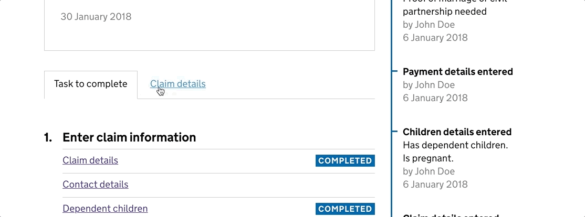

# Last updated 22 March 2018



## General info
**Name**   
Tabs

**Description**   
Accessible tabs to allow you to show and hide content.

**Services**
  - Bereavement

---

## Notes
### Design
They were influenced heavily by the tabs on the GOVUK bank holidays page. The main difference being the hover colour; as the contrast ratio on the bank holiday tabs fails WCAG-AA. So for accessibility reasons, I lightened the grey on the hover colour to meet AA.

### User reserch
**Bereavement**   
The design started out as multiple pages and links. But agents had issues reorientating themselves when they clicked back and forth as they always ended up at the top of the page once it loaded. The introduction of tabs allowed them to flick between the information quickly without losing their place.

## Development
The tabs have been designed and built with accessibility in mind. The Javascript applies aria-hidden attributes to each content panel to let screen readers know which content is visible. It also adds aria-selected to the active tab.

The tabs work as a progressive enhancement. If Javascript is turned off, all of the content is visible in the page in a linear order, and instead of tabs you just get a list of regular links, which are anchor-linked to the sections using their ids.

## Accessibility
This has been tested by the DWP Accessibility Compliance Team and users. To date it has no known issues with JAWS, Dragon, ZoomText and Read&Write.

---

# How to use

### Step 1 - The CSS
Copy the file `_tabs.scss` into your `app/assets/sass/` folder.

Open your `application.scss` file and add the following line at the bottom:

```@import 'tabs';```

### Step 2 - The Javascript
Copy the file `tabs.js` into your `app/assets/js` folder.

Open your `app/views/includes/scripts.html` file and add the following line just above `<script src="/public/javascripts/application.js"></script>`.

```<script src="/public/javascripts/tabs.js"></script>```

### Step 3 - The HTML
Copy the HTML wherever you want to display the tabs in your prototype.
Edit the existing enteries or add new ones.
